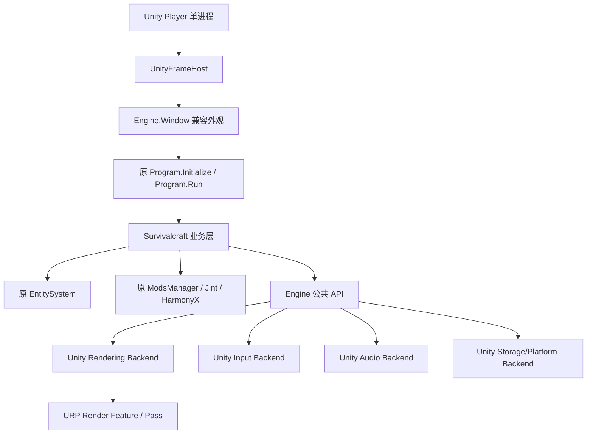

# Survivalcraft API Windows 端迁移到 Unity 的执行计划

> 状态：阶段 0 已完成；阶段 1 的 Mono、数学/序列化/完整 EntitySystem、FLAC 和 ImageSharp 已验收。三个核心程序集已改为由 Unity 直接编译的本地源码包（2026-09-13），并已把原版加载、主菜单与设置交互的核心循环接入主项目 Assets/SCUnity/Scenes/Survivalcraft.unity。原版音效/流式音乐、初始平坦世界的地形/天空/模型与保存重载已接通；完整世界视觉对照与 API/模组回归仍未完成，当前是增量接入，范围见 [桌面说明](../Port/Compatibility/Desktop/README.md)。
>
> 调研日期：2026-09-12
>
> Unity 基线：`6000.3.12f1`、URP `17.3.0`、Input System `1.19.0`
>
> 上游基线：`External/SurvivalcraftApi`，`SCAPI1.9` 分支，提交 `98e5f58f779dba20503a095073451a40899549c4`

## 1. 决策摘要

采用“**保留游戏核心和公开 API，替换 Engine 平台后端，由 Unity PlayerLoop 驱动原主循环**”的路线。

- 游戏只运行在一个 Unity Player 进程和一个 Unity 窗口中。不得启动原 Windows 可执行文件，不得创建第二个 GLFW/SDL 窗口或 OpenGL 上下文，也不得嵌入一个继续独立运行完整游戏的外部宿主。
- `Engine`、`EntitySystem`、`Survivalcraft` 继续作为三个同名程序集存在。原有 ECS、方块、地形、存档、Widget、Screen、Manager、Subsystem 和模组系统保留；Unity 提供窗口、生命周期、渲染设备、输入、音频、文件路径和平台集成服务。
- 当前交付范围仅为 **Windows x86-64 桌面非 VR 模式**。上游现有 OpenXR/VR 后端不迁移、不接入 Unity XR，也不作为本轮完成条件。
- Windows 首版固定使用 Unity **Mono** 脚本后端和 **.NET Framework** API Compatibility Level。三个核心程序集由 Unity 自带 Roslyn 4.3.1 直接编译；仅核心包的 `csc.rsp` 启用 C# 10，以保留结构体构造语义。第三方依赖恢复独立于核心源码编译。
- `.scmod` 的包结构、目录、元数据、依赖排序、资源覆盖、JavaScript、`ModLoader` 钩子、类型发现和 HarmonyX 语义都属于必须保留的兼容契约。
- 当前模组模板直接目标为 `net10.0`。Unity 官方明确不支持加载以 .NET Core 为目标的托管插件，因此已经发布的 `net10.0` 模组 DLL 不能作为“无需重编译即可加载”的承诺。迁移版 SDK 将为相同 NuGet 包增加 `net48` 目标，保持源码、程序集名和公开 API，使现有模组只需重新编译并按原方式打包为 `.scmod`。
- 不增加方块、玩法、界面、渲染效果或其他业务可见能力。新增代码限于兼容层、Unity 后端、构建工具、自动化验证和诊断代码。

如果把“兼容目前模组加载方式”解释为“现有 `net10.0` DLL 一个字节不改即可运行”，它与 Unity 支持的托管运行时以及“不得在 Unity 内再运行另一套程序/运行时”的约束冲突。本文把兼容目标定义为：**原包格式和加载行为兼容，模组源码/API 兼容，托管 DLL 需要面向 Unity 目标重编译一次**。

## 2. 五项不可退让的迁移契约

### 2.1 模组加载兼容

以下行为必须从现有实现直接继承或按等价顺序复现：

1. 从 `Mods` 目录递归发现 `.scmod`。
2. 将 `.scmod` 作为 ZIP 读取，识别 `modinfo.json`、`modsettings.json`、图标、根目录 DLL 和 `Assets/`。
3. 保留版本范围、依赖、`LoadOrder`、`LoadAfter` 和稳定拓扑排序；发生依赖环时沿用当前降级行为。
4. 内置 `Content.zip` 与模组 `Assets/` 进入同一套资源合并过程，后加载模组覆盖同路径资源。
5. 先加载程序集，再解析需要模组类型的设置；保留 `AssemblyResolve`、`Assembly.Load(byte[])` 和 `TypeCache` 的程序集发现语义。
6. 继续发现并实例化 `ModLoader`、自定义 ContentReader、Block、CreatureSpawnRule 等类型。
7. 保留 JavaScript 初始化、注册和逐帧更新位置。
8. 保留 `ModLoader` 钩子的签名、调用点和前后顺序，保留 HarmonyX 在同一 Mono 运行时中修补游戏方法的能力。

当前实现证据位于 [ModsManager.cs](../External/SurvivalcraftApi/Survivalcraft/ModsManager/ModsManager.cs)、[ModEntity.cs](../External/SurvivalcraftApi/Survivalcraft/ModsManager/ModEntity.cs)、[LoadingScreen.cs](../External/SurvivalcraftApi/Survivalcraft/Screen/LoadingScreen.cs) 和 [TypeCache.cs](../External/SurvivalcraftApi/Engine/Engine.Serialization/TypeCache.cs)。官方模组模板也验证了现有构建方式是 `net10.0` DLL 加资源一起压缩为 `.scmod`。

### 2.2 Unity 必须成为实际框架

Unity 拥有并提供以下运行时资源：

| 领域 | Unity 的职责 | 保留的 Survivalcraft 语义 |
|---|---|---|
| 生命周期 | PlayerLoop、焦点、暂停、退出、分辨率变化 | `Window` 事件与原初始化/关闭顺序 |
| 主循环 | 每个 Unity 帧调用一次兼容宿主 | `BeforeFrameAll → Program.FrameHandler/Run → AfterFrameAll` |
| 渲染 | Unity 图形设备、URP Render Feature/Pass、RenderGraph/CommandBuffer | `Engine.Graphics` 类型、绘制顺序、RenderTarget 和状态语义 |
| 输入 | Input System 采样物理设备 | Keyboard、Mouse、Touch、GamePad 的原静态状态和单帧事件 |
| 音频 | Unity AudioSource/AudioClip/PCM 流 | Mixer、SoundBuffer、音量和播放控制语义 |
| 存储 | `Application.streamingAssetsPath`、`persistentDataPath` 和 Windows 桥接 | `app:`、`data:`、`system:` 虚拟路径与存档布局 |
| 平台能力 | Unity API 或同进程原生插件 | 剪贴板、IME、文件选择、URI、文件拖放 |

Unity 不接管游戏规则。不得把每个 Entity 改成 GameObject，不得把 Component/Subsystem 改成 MonoBehaviour，不得以 Unity Physics、Animator、uGUI 或 UI Toolkit 重写原有业务系统。

### 2.3 禁止新增业务可见功能

| 变更类别 | 规则 |
|---|---|
| 兼容层、平台后端、桥接、构建脚本、测试与诊断 | 允许 |
| 为兼容旧 API 而增加的 BCL shim/polyfill | 允许，运行时实现在源码包 Properties，历史生成配置保留于 `Port/Compatibility` |
| 上游业务源文件的语法降级或平台条件编译 | 仅允许机械变更，必须有补丁和理由 |
| Block、Component、Subsystem、Widget、Screen、Manager、世界生成、存档规则 | 默认禁止修改业务行为 |
| 新方块、新配方、新 UI、新玩法、新画面效果、新业务配置 | 禁止 |
| 以“迁移方便”为由替换或简化核心模块 | 禁止；只能登记差异并继续寻找等价实现 |

### 2.4 上游可持续迁移

按源码接入决策，`External/SurvivalcraftApi` 现为保留 SC 历史的可编辑移植分支。三个源码包在原路径上维护，主项目通过 Git 子模块固定提交；上游更新在源码分支 merge 或 cherry-pick，不在构建时覆盖用户编辑。`upstream-lock.json` 与历史补丁仍冻结，`source-lock.json` 单独追踪移植提交及上游祖先。详见 [源码接入说明](UnitySourceIntegration.md)。

### 2.5 核心循环与业务模块保全

主循环调用顺序、ECS 更新顺序、绘制顺序、模组钩子顺序、内容合并顺序和存档格式都是回归基线。任何不能等价实现的模块必须进入差异登记表，说明影响、证据、尝试过的方案和恢复条件；不得静默删除或以新功能替代。

### 2.6 当前平台范围

| 范围 | 状态 |
|---|---|
| Windows x86-64 桌面 Player | 本轮必须完成 |
| 键盘、鼠标、手柄、窗口/全屏、桌面音频和文件系统 | 本轮必须完成 |
| OpenXR、头显显示、VR 控制器与 VR 交互 | 本轮明确不迁移 |
| Android、iOS、Linux、Browser | 不在本轮范围 |

为保护公开 API，共享的 VR 类型和成员如被三个兼容程序集公开引用，应保留其签名；Unity 桌面后端不注册 VR 服务，并稳定报告 VR 未启动。`Engine.Windows/VR`、Silk OpenXR 依赖及原 OpenGL 上下文绑定代码标记为 `exclude-platform`。依赖 VR 的模组仍能经过通用模组加载流程，但 VR 行为不属于本轮兼容验收，并在最终报告中标为“超出当前桌面范围”。

## 3. 调研结果

### 3.1 代码与运行结构

上游采用 `Engine → EntitySystem → Survivalcraft` 三层结构，约有 1,405 个 C# 文件、17.46 万行代码：

| 模块 | C# 文件 | 代码行 | 迁移策略 |
|---|---:|---:|---|
| Engine | 327 | 37,800 | 保留公共表面、数学、集合、序列化和媒体数据结构；替换平台后端 |
| EntitySystem | 20 | 2,054 | 原样保留为主 |
| Survivalcraft | 1,058 | 134,744 | 保留全部业务逻辑，只替换入口和少量直接平台调用 |

Engine 中图形、动画、媒体和平台代码占主要迁移工作。游戏层约有 288 个文件引用 `Engine.Graphics`，约 268 个文件引用 `ContentManager`，约 53 个文件引用 `Storage`。这说明应稳定这些 API 的外观，在它们内部更换实现，不能从业务调用点向上重写。

现有 Windows 版本已经在本机使用 .NET 10 SDK 完整构建，结果为 0 警告、0 错误。主调用链由 [Window.cs](../External/SurvivalcraftApi/Engine/Engine/Window.cs) 和 [Program.cs](../External/SurvivalcraftApi/Survivalcraft/Game/Program.cs) 定义：

```text
Window.RenderFrameHandler
  Time.BeforeFrame
  Dispatcher.BeforeFrame
  Display.BeforeFrame
  Keyboard/Mouse/Touch/GamePad.BeforeFrame
  Mixer.BeforeFrame
  Program.FrameHandler
    首帧: Program.Initialize
    后续: Program.Run
      Managers 更新
      ScreensManager.Update
      DialogsManager.Update
      JsInterface.Update
      ScreensManager.Draw
  Time/Dispatcher/Display/Input/Mixer.AfterFrame
  原后端交换缓冲区
```

`SubsystemUpdate` 和 `SubsystemDrawing` 又分别维护业务对象的有序 Update/Draw 列表，并在对应位置分发模组钩子。这条顺序必须整体进入 Unity，不能拆散到任意数量的 MonoBehaviour 回调中。

### 3.2 Unity 与上游工具链差距

上游 Windows 目标为 `net10.0-windows`，语言版本为 preview。源码中已发现至少 877 处集合表达式匹配、13 处主构造函数、36 处 `required` 相关使用、37 处 `nint/nuint` 使用和 32 个含 `unsafe` 的文件。Unity 文档声明 C# 9 支持；本机 6000.3.12f1 自带 Roslyn 4.3.1，可通过程序集局部响应文件使用 C# 10。本次已将更高版本语法降级，并通过固定版本 Windows Mono 验收；不承诺其它 Unity 版本或平台。

Unity 6 官方支持的托管插件目标是 .NET Standard 和 .NET Framework，不支持 .NET Core；其 `.NET Framework` 兼容级别包含 .NET Framework 4.8 与额外的 .NET Standard 2.1 API。因此选择：

- 核心程序集：Unity 自带编译器，三个本地 UPM/asmdef，`LangVersion=10`，按需启用 unsafe。
- Unity 桥接程序集：Unity 自带编译器，限制为 C# 9。
- Windows Player：Mono，原因是运行时程序集加载、完整反射、动态代码和 HarmonyX 是模组契约的一部分。
- IL2CPP：本次 Windows 兼容目标不支持；等价托管模组能力建立之前不得切换。

本地反射探针得到的当前公开表面基线为：

| 程序集 | 导出类型 | 声明的 public 成员 |
|---|---:|---:|
| Engine | 410 | 5,941 |
| EntitySystem | 22 | 380 |
| Survivalcraft | 1,290 | 18,530 |

这些数量不是兼容性的充分条件。后续 API 门禁还要比较程序集名/版本、类型全名、基类、接口、泛型约束、方法签名、字段、属性、事件、枚举值和必要的布局信息。

### 3.3 依赖差距

| 分类 | 当前依赖/能力 | 处理方向 |
|---|---|---|
| 可优先复用 | HarmonyX、Jint、NVorbis、NLayer、SharpGLTF、NCalc | 选用其 `net462/netstandard2.0` 等兼容资产并做 Unity Mono 运行探针 |
| 需要换版本或实现 | ImageSharp 3.1.12、`NAudio.Flac.Unknown.Mod`、部分 .NET 10 BCL API | 换为 net48 可运行版本或写媒体/BCL 后端；像素、PCM 和异常行为需有对照测试 |
| 由 Unity 取代 | Silk.NET.Windowing、OpenGLES、OpenAL、Input | 由生命周期、URP、Unity Audio 和 Input System 适配器实现 |
| Windows 同进程桥接 | NativeFileDialog、TextCopy、ImeSharp、URI/文件关联 | 使用 Unity API 或小型原生插件，保持原调用语义 |
| 本轮排除 | Silk OpenXR、`Engine.Windows/VR` | 不引入 Unity XR；保留必要公开类型签名，运行时稳定报告 VR 未启动 |

已知需要 shim 或改写调用面的 BCL 包括 `System.Collections.Frozen`、`System.Threading.Lock`、`PriorityQueue<T>`、部分 `System.Text.Json.Nodes` 和新式参数检查 API。shim 必须是后端模块，不能改变业务算法和比较顺序。

### 3.4 内容与渲染

内置内容约 829 个文件、20 MB，主要包含 WebP、FLAC、DAE、OGG、JSON/XML 和文本。资源仍以 `Content.zip` 进入原 `ContentManager`；不能先全部转成 Unity 资产并绕开模组合并，因为那会破坏运行时覆盖行为。

迁移后的读取流程为：

1. 未修改的 `Content.zip` 位于 `StreamingAssets`。
2. 启动时通过 Storage 适配器打开内置包，随后按原顺序打开 `.scmod`。
3. 原 `ContentManager` 完成路径归一、覆盖、Reader 选择与缓存。
4. Reader 的后端把解码结果创建为 Unity Texture、Mesh、AudioClip 或兼容对象。

原工程共有 9 组内置 GLSL Shader 组合。内置 Shader 需要离线翻译成 URP ShaderLab/HLSL，并由原 Shader 名和宏组合映射到预编译变体。`Engine.Graphics` 仍记录原有绘制命令，Unity URP Render Pass 在同一帧按原顺序提交。

模组携带的任意 `.vsh/.psh` 不能直接当作 Unity Shader 在 Player 内编译。计划提供离线转换/验证工具并允许 `.scmod` 附带 Windows Unity AssetBundle 作为后端资源；无法转换的自定义 Shader 模组必须在最终兼容报告中逐项列出。该工具只服务既有渲染语义，不引入新的渲染能力。

## 4. 目标架构



### 4.1 单帧映射

`UnityFrameHost.Update` 每帧只执行一次以下逻辑：

```text
采样 Unity 输入和窗口状态
Engine.Time.BeforeFrame
Engine.Dispatcher.BeforeFrame
Engine.Display.BeforeFrame
Engine.Keyboard/Mouse/Touch/GamePad.BeforeFrame
Engine.Mixer.BeforeFrame
Program.FrameHandler                    保留 Initialize/Run 分支
Engine.Time/Dispatcher/Display/Input/Mixer.AfterFrame
封存本帧 Engine.Graphics 命令列表
```

URP 随后在 `ScriptableRenderPass` 中消费已封存的命令列表。GPU 提交位置会从原窗口 Render 回调移动到 URP，但业务可观察到的 `Draw` 顺序、状态变化、RenderTarget 切换和模组绘制钩子顺序不得变化。下一帧前完成资源回收和异步读取结果派发。

Unity 生命周期映射如下：

| Unity 事件 | 兼容事件/动作 |
|---|---|
| `Awake/Start` | 创建后端、绑定事件、调用原入口初始化步骤 |
| `Update` | 执行完整单帧序列 |
| `OnApplicationFocus/OnApplicationPause` | Activated/Deactivated，清理瞬时输入状态 |
| 分辨率或全屏状态变化 | SizeChanged/WindowModeChanged |
| `OnApplicationQuit/OnDestroy` | Closed、按逆序 Dispose |
| 原 Restart 请求 | 同进程完整 teardown 后重新初始化；不得 `Process.Start` 另一程序 |

### 4.2 图形对象映射

| Engine.Graphics | Unity 后端 |
|---|---|
| Texture2D/Cubemap/CompressedTexture2D | Unity Texture 对象与原格式元数据 |
| VertexBuffer/IndexBuffer/UniformBuffer | GraphicsBuffer/Mesh/MaterialPropertyBlock |
| RenderTarget2D | RenderTexture/RTHandle |
| Blend/Depth/Rasterizer/Sampler state | Shader 变体、Material 与 RenderStateBlock |
| Shader/ShaderParameter | 预编译 Unity Shader、关键字和属性绑定表 |
| Display.Draw* | 顺序命令列表，由 URP Render Pass 提交 |

`Survivalcraft/Widget/ViewWidget.cs` 的直接 framebuffer blit 和 `SubsystemModelsRenderer` 对 GL 限制的查询是已知越界点，必须改为调用后端能力接口。Player 中不得保留 Silk.NET OpenGL、ANGLE 交换链或原窗口事件循环。

## 5. 可持续迁移仓库结构

```text
External/SurvivalcraftApi/                 保留上游历史的源码移植子模块
  Engine/ EntitySystem/ Survivalcraft/     三个 Unity 本地源码包及 asmdef/csc.rsp
Port/
  upstream-lock.json                      冻结的原版基线
  source-lock.json                        当前源码分支提交、上游祖先和 Unity 版本
  Compatibility/Desktop/                 历史可重放兼容配置
  Dependencies/Unity/                     独立第三方依赖项目和包锁
  Build/source.py                        依赖恢复、内容打包、源码验收
  Tests/Baselines/unity-source/           源码编译/API/运行证据
Assets/SCUnity/                           Unity 宿主、渲染、音频、输入与场景
Assets/StreamingAssets/Survivalcraft/     Content.zip/init.js
```

源码只在迁移时转换一次，之后直接编辑和提交子模块。Unity 编译器读取原路径源码，构建脚本不得再用历史 profile 覆盖它们。历史 SourceManifest 与 Desktop profile 保留输入、排除和补丁依据。

## 6. 上游更新流程

1. 在源码分支 fetch 指定 SC 上游分支，审查文件、依赖和公开 API 差异。
2. 精选修复使用 `git cherry-pick -x <commit>`；完整同步使用 merge，保留真实上游祖先。
3. 在原路径解决冲突、适配新语法和运行时差异；不重写已有移植编辑。
4. 更新第三方依赖或内容时显式审查包锁、内容清单和必要的基线变化。
5. 更新源码提交、`source-lock.json` 和父仓库 gitlink，运行干净主项目副本的 Player、Editor、API 及单元检查。
6. 验收通过后先推源码分支，再推父项目。完整命令见 [源码说明](UnitySourceIntegration.md)。

普通 Unity 构建使用固定子模块提交，不会自动拉取或合并远端更新。原始 `upstream-lock.json` 与证据只有在专门的上游基线升级中才能变更。

## 7. 分阶段实施计划

### 阶段 0：建立不可回退的基线

工作项：

- 固化上游 SHA、依赖锁、源文件清单、Content 文件清单和三程序集公开 API 快照。
- 在原 Windows 端加入仅测试使用的事件记录器，采集启动、LoadingScreen、主菜单、一段固定世界游戏过程的有序事件。
- 建立存档样本：新世界、已有世界、退出重载、转换前旧存档和恢复存档。
- 建立模组样本集：纯资源、数据/XML 覆盖、JavaScript、ModLoader、自定义 ContentReader、Block 类型、Harmony 补丁、相互依赖、加载顺序、冲突资源、自定义 Shader。
- 建立“禁止业务变化”清单和首份 `PortCompatibilityReport.md`。

退出条件：基线可在干净环境重复生成；每个后续阶段都能运行同一套差异检查。

### 阶段 1：兼容编译与模组可行性闸门

工作项：

- 创建三个 `net48` 兼容工程，保持程序集名、版本、命名空间和公开类型。
- 建立 SourceManifest、暂存生成器、补丁系统和 BCL shim。
- 移除 Silk 平台实现，先提供无图形的接口后端；替换不能用于 net48 的包。
- 把 Unity Windows Player 显式固定为 Mono 和 .NET Framework API Compatibility Level。
- 在最小 Unity Player 中验证 `Assembly.Load(byte[])`、`AssemblyResolve`、TypeCache 刷新、ModLoader 实例化、Jint 和 HarmonyX 实际补丁。
- 把官方模板模组改为多目标构建，证明同一源码能生成原 `net10.0` 包和 Unity `net48` 包。

退出条件：

- 三程序集可由干净环境生成并由 Unity 加载。
- 公开 API 门禁无未登记差异。
- 一个真实模板模组在 Unity Mono 中完成发现、实例化、钩子调用和 Harmony 补丁。
- 若 Harmony 或动态程序集加载不能在目标 Unity 版本成立，暂停后续迁移并重新评估；不得用第二进程或嵌入 CoreCLR 绕过。

### 阶段 2：Unity 宿主、存储与完整加载序列

工作项：

- 实现 `UnityFrameHost`，映射焦点、暂停、窗口、时间、Dispatcher、日志和退出。
- 实现 `app:`、`data:`、`system:`，内置内容只读，存档与 Mods 目录可写。
- 保留 LoadingScreen 的动作顺序：资源/Reader、模组 DLL、语言、设置、JavaScript、钩子、方块/数据库/配方合并、Screen/Manager、`OnLoadingFinished`。
- 使用无图形命令记录后端跑过 `Program.Initialize`，进入 MainMenuScreen。
- 对比原 Windows 与 Unity 的启动/帧事件 trace。

退出条件：单个 Unity 进程完成完整加载，数据库、方块、语言、内容覆盖和主菜单状态正确；主循环顺序差异为零。

### 阶段 3：渲染、输入、音频和媒体纵切

工作项：

- 建立 Engine.Graphics 命令记录层与 URP RendererFeature/RenderPass。
- 实现纹理、Buffer、RenderTarget、状态对象和内置 Shader 映射；逐项校验坐标系、矩阵约定、深度范围、UV 方向、裁剪面和透明排序。
- 保留 Widget 的布局、命中测试和绘制逻辑；接入 Input System 状态快照。
- 替换 WebP/FLAC/MP3/OGG/DAE 等媒体后端，比较解码尺寸、像素、PCM 帧数和模型数据。
- 接入 Unity Audio，同时保留 Mixer 语义和每帧更新点。

退出条件：主菜单可操作；进入标准新世界后，一个完整区块、天空、模型、透明物体和 HUD 与基线截图/状态一致；声音与输入通过样本测试。

### 阶段 4：全业务模块保全

按原依赖关系恢复并回归：

- ECS 实例化和反射类型解析。
- 地形生成、区块更新、方块行为、碰撞和原自研物理。
- 生物、玩家组件、动画、电路、天气、时间和世界设置。
- Widget、Screen、Dialog、内容提供器和社区内容流程。
- 存档、自动保存、导入导出、升级转换和损坏恢复。
- 多玩家同屏对应的原视图、输入和绘制顺序。

退出条件：固定种子世界在指定帧生成相同业务快照；新旧存档读写回环成功；连续游玩、保存、退出、重新载入不改变核心状态。

### 阶段 5：完整模组兼容回归与 SDK

工作项：

- 运行阶段 0 的全部模组样本，并增加真实社区模组回归集。
- 发布同包名的多目标 SDK/NuGet 构建方案，使现有模组项目可选择 `net10.0` 或 Unity `net48`，不要求修改业务源码。
- 验证程序集依赖解析、同名资源覆盖、失败隔离、冲突报告、设置 UI、脚本每帧更新和卸载/重启行为。
- 为自定义 Shader 建立离线转换和 AssetBundle 校验；记录未能转换的模组。
- 输出模组作者迁移说明，只描述目标框架与构建命令变化。

退出条件：除已登记且有证据的限制外，所有原加载行为和样本模组通过；任意失败不会破坏未涉事模组或游戏主循环。

### 阶段 6：Windows 桌面能力与稳定化

工作项：

- 恢复剪贴板、IME、文件选择、URI、拖放、文件关联和同进程重启语义。
- 做长时间运行、设备丢失/分辨率切换、焦点切换、内存和 GC 压力测试。
- 完成 Release 构建、干净安装、升级安装、崩溃日志和无开发环境机器验证。
- 确认构建不包含 Silk OpenXR、原 VR 后端或 Unity XR 运行依赖，并冻结最终 API、模块和模组兼容报告。

退出条件：满足第 9 节的全部完成定义，所有例外均有用户可评估的报告。

## 8. 验证与持续集成门禁

| 门禁 | 方法 | 失败条件 |
|---|---|---|
| 上游可构建 | 构建固定 SHA 的 Windows 版本 | 上游基线自身失败 |
| 文件归属 | SourceManifest 与上游树比对 | 存在未分类或丢失文件 |
| 源码可复现 | 固定源码 gitlink、上游祖先、包锁与 Unity 版本 | 检出漂移、未提交源码或外部核心 DLL |
| 公开 API | APICompat/反射快照对比 | 未登记的签名、继承或程序集变化 |
| 单进程 | 运行时进程、窗口和模块检查 | 启动外部游戏、第二窗口/图形上下文 |
| 主循环 | 原 Windows 与 Unity 有序 trace 对比 | 帧级事件、Update/Draw/Hook 顺序变化 |
| 业务确定性 | 固定输入/种子下状态校验和 | 业务状态在允许误差外变化 |
| 内容 | Content 与覆盖结果清单 | 路径、Reader、覆盖顺序或解码结果变化 |
| 存档 | 样本读取、保存、重载、旧版转换 | 数据丢失或不可逆格式漂移 |
| 模组 | 类型/资源/JS/Hook/Harmony 样本矩阵 | 加载语义、依赖顺序或隔离失败 |
| Unity Player | EditMode、PlayMode、Windows 构建和冒烟测试 | Editor 可跑但 Player 失败 |
| 业务变更审计 | 补丁目录与受保护路径检查 | 未登记修改业务模块 |

主循环 trace 至少记录：帧号、时间推进、Dispatcher、输入快照、Manager 更新、Screen/Dialog 更新、JS 更新、Subsystem Update 顺序、Subsystem Draw 顺序、ModLoader 前后钩子、RenderTarget 切换和命令列表封存点。

性能门禁在功能等价后建立。首先保证行为正确，再以原 Windows 版本和目标硬件测量帧时间、GC 分配、加载时间、内存和绘制命令；优化不得改变可观察业务语义。

## 9. 完成定义

迁移只有同时满足以下条件才算完成：

1. 游戏在单个 Unity Player 进程中运行，Unity 实际提供生命周期、渲染、输入、音频和平台服务。
2. 原主循环、ECS 更新、绘制及模组钩子顺序通过自动对照。
3. `Engine.dll`、`EntitySystem.dll`、`Survivalcraft.dll` 的公开 API 无未登记破坏。
4. `.scmod` 目录、包格式、依赖排序、资源覆盖、JavaScript、ModLoader、类型发现和 Harmony 测试通过。
5. 模组可从原源码面向 Unity 目标重新编译；不把 `net10.0` DLL 直接加载列为虚假承诺。
6. 方块、ECS、世界、存档、UI、音频、内容和同屏游戏等业务模块均已保全，或在最终报告中逐项列出无法达到的部分。
7. 没有新增业务可见功能；全部本地差异都属于后端、桥接、兼容、构建或测试。
8. 把子模块更新到新的 `SCAPI1.9` 提交后，在源码分支解决合并冲突后，自动化能够校验提交、运行门禁并报告具体差异。
9. 交付物是 Windows x86-64 桌面非 VR Player；VR 未迁移且不影响非 VR 主循环、模组加载和业务模块验收。

最终交付的 `PortCompatibilityReport.md` 至少包含：模块状态、模组类别状态、API 例外、存档差异、渲染差异、平台差异、证据链接、剩余影响和后续恢复条件。

## 10. 第一轮实施顺序

第一轮不从渲染开始，先消除最大的架构不确定性：

1. 创建 `upstream-lock.json`、SourceManifest 和公开 API 基线。
2. 创建三个 `net48` 兼容工程与最小 BCL shim，使无图形核心可编译。
3. 在 Unity Mono Player 中验证动态加载、TypeCache、ModLoader、Jint 和 HarmonyX。
4. 用官方模板模组建立 `net10.0;net48` 多目标样例，并保持原 `.scmod` 打包布局。
5. 实现 UnityFrameHost、Storage 和无图形命令后端，跑到 MainMenuScreen。

完成这五步后再进入 URP。这样最早验证用户最关心的模组兼容、单进程 Unity 框架、API 保全和持续同步能力。

## 11. 已知高风险项

| 风险 | 当前判断 | 降低风险的最早动作 |
|---|---|---|
| 已发布 `net10.0` 模组 DLL | Unity 官方不支持直接加载 | 阶段 1 完成同源码 `net48` 重编译链路 |
| HarmonyX 在 Unity 6 Mono 的具体补丁覆盖率 | 包目标兼容，但必须运行验证 | 阶段 1 用构造器、虚方法、泛型和游戏方法样本测试 |
| 任意模组 GLSL | Unity 运行时 Shader 模型不同 | 阶段 0 收集样本，阶段 3/5 做离线转换与报告 |
| OpenGL → URP 的像素/排序差异 | 工作量最大，涉及大量绘制调用 | 先做命令 trace，再逐 Shader、状态和 RenderTarget 对照 |
| WebP/FLAC 与当前包目标不兼容 | 不能只预转换内置资源，否则模组会失效 | 阶段 1 确定运行时解码器，阶段 3 做输出对照 |
| 反射和动态类型 | API 面很大且用于数据库/模组 | Mono 固定、API 快照、TypeCache 和真实模组早期门禁 |
| IME/文件关联 | 平台耦合强 | 基础循环稳定后用同进程 Unity/原生桥接逐项恢复 |

VR 不列为风险项或未完成模块：它是本轮明确排除的范围。若未来启动 VR 迁移，应单独制定 Unity OpenXR 适配计划和验收基线，不与当前桌面迁移混合实施。

## 12. 参考资料

- [上游架构文档](../External/SurvivalcraftApi/docs/Architecture.md)
- [上游开发文档](../External/SurvivalcraftApi/docs/Development.md)
- [Unity 6：.NET 配置文件支持](https://docs.unity3d.com/cn/6000.0/Manual/dotnet-profile-support.html)
- [Unity 6：C# 编译器](https://docs.unity3d.com/cn/6000.0/Manual/csharp-compiler.html)
- [Unity 6：脚本后端](https://docs.unity3d.com/6000.0/Documentation/Manual/scripting-backends-intro.html)
- [Unity 6：StreamingAssets](https://docs.unity3d.com/6000.0/Documentation/Manual/StreamingAssets.html)
- [官方 Survivalcraft API 模组模板](https://gitee.com/SC-SPM/SurvivalcraftTemplateModForAPI)
